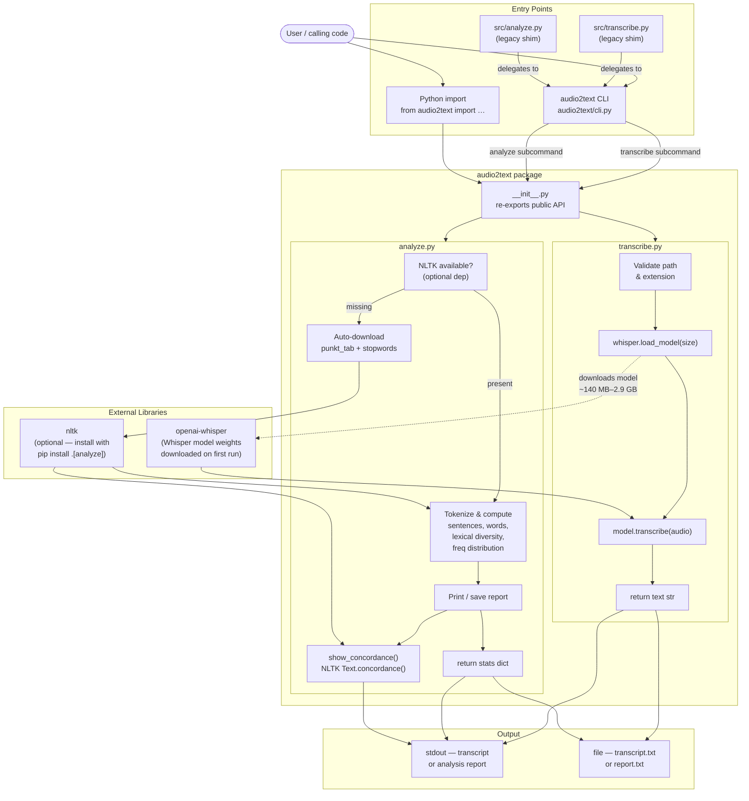
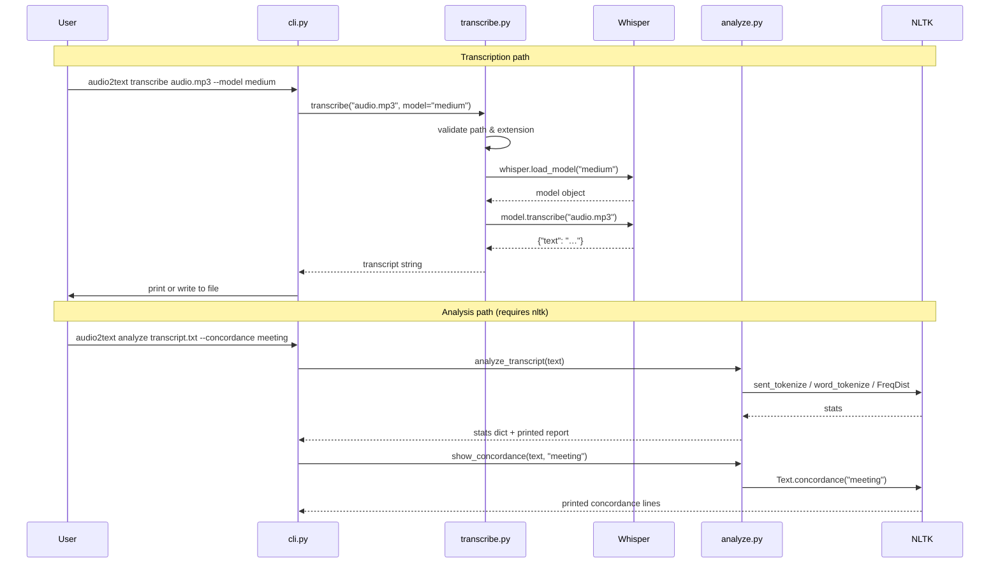
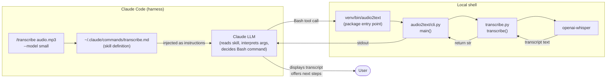
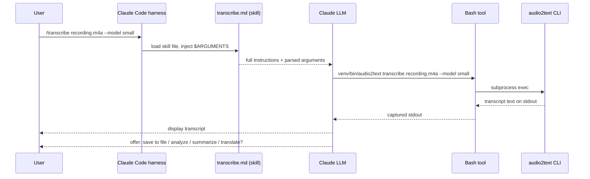

# audio2text — Architecture

## How It Works

`audio2text` is an installable Python package that wraps [OpenAI Whisper](https://github.com/openai/whisper) for local audio transcription and NLTK for transcript analysis. No API keys required — everything runs on your machine.

## Component Flow

## Subcommand Data Flow

## The `/transcribe` Claude Code Skill

### What a skill is

A Claude Code skill is a Markdown file stored in `~/.claude/commands/<name>.md`. When a user types `/transcribe` in Claude Code, the harness loads that file and injects its content as instructions for the current turn. The skill is the glue between a conversational prompt and a concrete CLI tool — it tells Claude exactly what command to run, how to parse arguments, and what to do with the output.

### How a skill wraps a Python tool

### The skill file (`~/.claude/commands/transcribe.md`)

The file has three parts:

| Part | Purpose |
|---|---|
| **Description line** | One-sentence summary shown in `/help` |
| **`$ARGUMENTS` placeholder** | The harness substitutes the text typed after `/transcribe` here |
| **Steps** | Numbered instructions Claude follows: parse args → resolve path → run the exact `audio2text` CLI command → display output → offer follow-up actions |

Because the skill hard-codes the venv path (`venv/bin/audio2text transcribe …`), it always uses the project's installed package rather than any system-wide binary.

### Skill invocation sequence

## Module Responsibilities

| Module | Responsibility |
|---|---|
| `cli.py` | Argument parsing, subcommand routing, error handling |
| `transcribe.py` | File validation, Whisper model loading & inference |
| `analyze.py` | NLTK dependency guard, tokenization, stats, concordance |
| `__init__.py` | Public API surface — `transcribe`, `analyze_transcript`, `show_concordance` |
| `src/*.py` | Backward-compatible shims — delegate directly to `cli.main()` |
