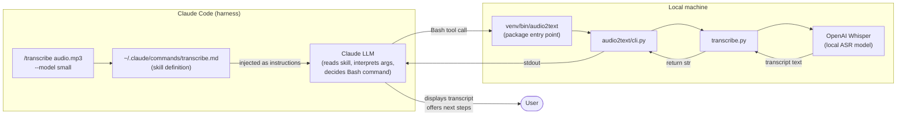
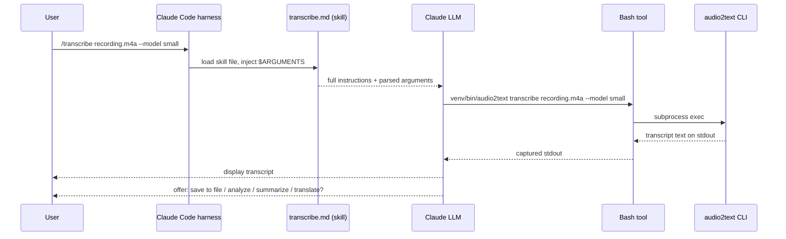
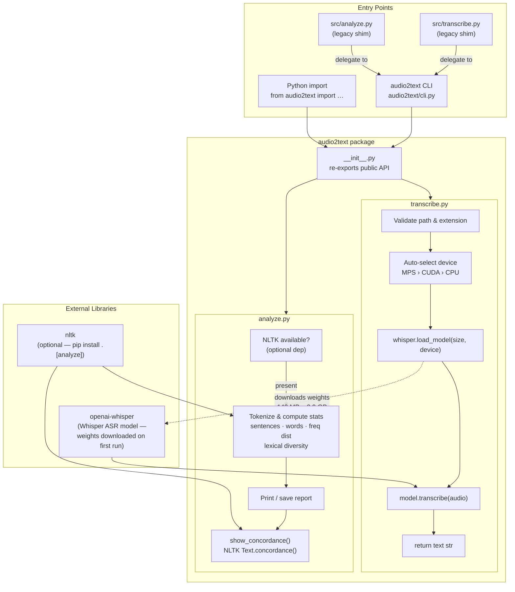
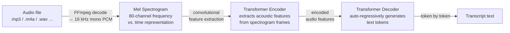
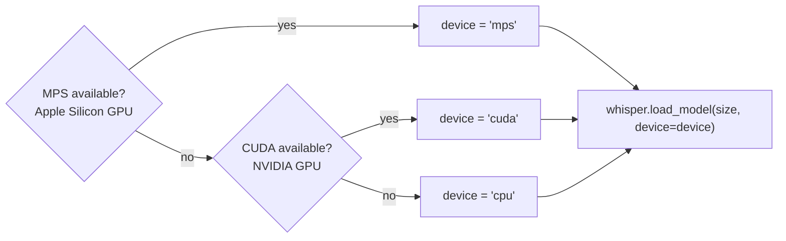

# audio2text — Architecture

## What This Is

`audio2text` is a locally-running speech-to-text tool. Its primary role is to serve as the backend for a **Claude Code skill** — when you type `/transcribe` in Claude Code, Claude invokes this tool via a Bash call to transcribe audio on your own machine, with no cloud API or internet connection required after setup.

---

## 1. The `/transcribe` Claude Code Skill

### What a skill is

A Claude Code skill is a Markdown file stored in `~/.claude/commands/<name>.md`. When a user types `/transcribe` in Claude Code, the harness loads that file and injects its content as instructions for the current turn. The skill is the glue between a conversational prompt and a concrete CLI tool — it tells Claude exactly what command to run, how to parse arguments, and what to do with the output.

### How the skill wraps the Python tool



### Skill invocation sequence



### The skill file (`~/.claude/commands/transcribe.md`)

| Part | Purpose |
|---|---|
| **Description line** | One-sentence summary shown in `/help` |
| **`$ARGUMENTS` placeholder** | The harness substitutes the text typed after `/transcribe` here |
| **Steps** | Numbered instructions Claude follows: parse args → resolve path → run the exact `audio2text` CLI command → display output → offer follow-up actions |

The skill hard-codes the venv path (`venv/bin/audio2text transcribe …`) so it always uses the project's installed package rather than any system-wide binary.

---

## 2. Local Python Package Architecture

The `audio2text` Python package is the tool the skill calls. It has two responsibilities: transcription and analysis.

### Package overview



### Module responsibilities

| Module | Responsibility |
|---|---|
| `cli.py` | Argument parsing, subcommand routing, error handling |
| `transcribe.py` | File validation, Whisper model loading & inference |
| `analyze.py` | NLTK dependency guard, tokenization, stats, concordance |
| `__init__.py` | Public API surface — `transcribe`, `analyze_transcript`, `show_concordance` |
| `src/*.py` | Backward-compatible shims — delegate directly to `cli.main()` |

---

## 3. How Whisper Works — Is It an LLM?

**No — Whisper is not a large language model.** It is an *automatic speech recognition* (ASR) model. Both share the Transformer architecture, but they are trained on fundamentally different inputs and for different tasks.

### LLM vs. Whisper

| | Large Language Model (e.g. Claude) | Whisper (ASR model) |
|---|---|---|
| **Input** | Text tokens | Raw audio waveform |
| **Trained on** | Vast text corpora | 680,000 hours of labeled audio |
| **Task** | Predict next text token | Convert speech → text |
| **Output** | Text tokens | Text transcript |

### Whisper's internal pipeline



1. **Audio decoding** — FFmpeg converts any supported format to a 16 kHz mono waveform.
2. **Mel spectrogram** — the waveform is transformed into a 2D representation of frequency energy over time (like a visual fingerprint of the sound). This is what the model "sees" — not raw audio samples.
3. **Encoder** — a stack of Transformer encoder layers reads the spectrogram and produces a dense representation of the acoustic content.
4. **Decoder** — a Transformer decoder generates the transcript one token at a time, attending to the encoder output (cross-attention). This is the same mechanism as a text-based seq2seq model, just conditioned on sound instead of text.

### Why this matters for usage

- **No internet needed** — the model weights are downloaded once and run entirely on your CPU or GPU.
- **Speed vs. accuracy tradeoff** — larger models (`medium`, `large`) have more encoder/decoder layers and produce better transcripts but take longer. `base` is a practical default for most recordings.
- **Multilingual** — Whisper was trained on 98 languages; it can auto-detect language or be directed with `--language`.

### GPU acceleration on Apple Silicon

Whisper out-of-the-box only auto-selects CUDA (NVIDIA). On a Mac it silently falls back to CPU — even on an M-series chip with a capable GPU sitting idle.

`transcribe.py` patches this with explicit device selection:



**Why GPU matters for ASR inference:**

Whisper's encoder and decoder are both Transformer stacks with large matrix multiplications at every layer. These operations map perfectly onto GPU hardware, which can run thousands of them in parallel. On CPU, the same computation is serialised across a handful of cores.

| Device | Who has it | Typical speedup vs. CPU |
|---|---|---|
| CPU | Everyone | 1× (baseline) |
| MPS | Apple Silicon (M1/M2/M3/M4) | ~3–5× |
| CUDA | NVIDIA GPU | ~5–10× |

On this machine (**MacBook Air M4**) you can confirm the active device at runtime:

```python
import torch
device = "mps" if torch.backends.mps.is_available() else \
         "cuda" if torch.cuda.is_available() else "cpu"
print(device)  # → mps
```
